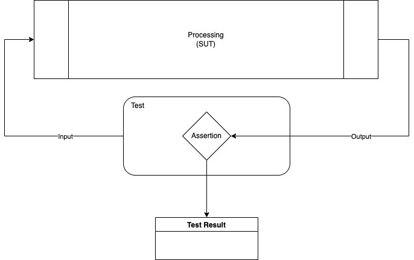
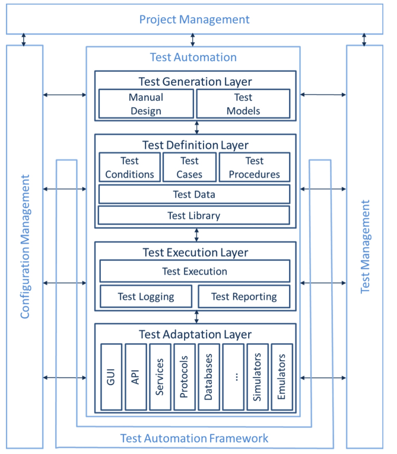

# Architecture

## What's an automated test?

We can define an automated (functional) test as a computer program that sends input to another system; compares the output sequence, or part of it, to some predefined expected result; and outputs the result of that comparision

### Generic test automation architecture

## Source

* [Complete Guide to Test Automation - Arnon Axelrod, Apress](https://www.amazon.com/Complete-Guide-Test-Automation-Maintaining/dp/1484238311)
* [Advanced-Test-Automation-Engineer-Syllabus-GA-2016](https://astqb.org/assets/documents/Advanced-Test-Automation-Engineer-Syllabus-GA-2016.pdf)